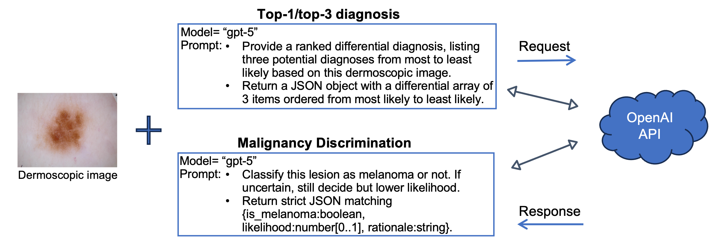
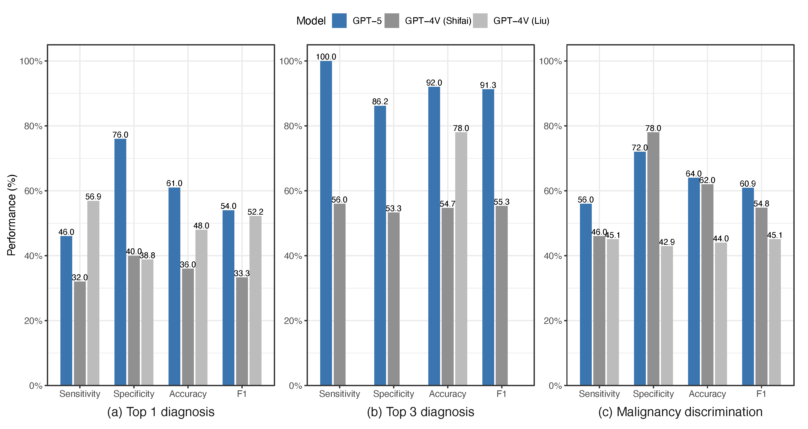
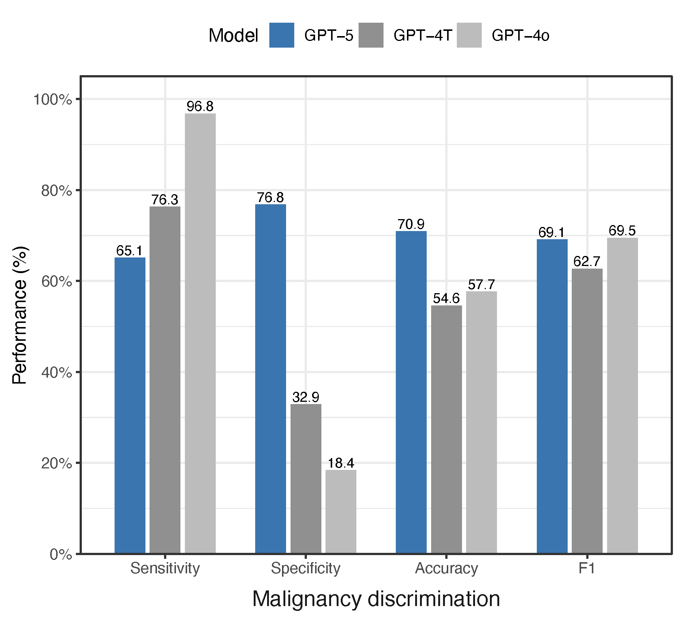

# Evaluating GPT-5 for Melanoma Detection Using Dermoscopic Images

The objective of this project is to evaluate the performance of the newly released GPT-5 for melanoma detection.

## System setup

To run the code on this Github site, a valid OpenAI API account and an API key are required. You can follow the following steps to set up your running environment:

1. Sign up at the OpenAI API platform.
2. Set up your payment method.
3. Generate an API key at https://platform.openai.com/api-keys, if you don't have it yet. 
4. Save your key as a global environment variable, OPENAI_API_KEY, so you can access across various applications and scripts on your system without hardcoding it.

## 1. Overall Diagnostic Performance of GPT-5

### Data sources
This project uses two popular datasets, the International Skin Imaging Collaboration (<strong>ISIC</strong>) Archive (https://api.isic-archive.com/images/) and the Human Against Machine with 10,000 training images (<strong>HAM10000</strong> or <strong>HAM10K</strong>) dataset (https://www.kaggle.com/datasets/kmader/skin-cancer-mnist-ham10000), to assess GPT-5's performance in melanoma detection. 

(1) A previous study by Shifai et al. randomly selected 50 melanomas and 50 benign nevi from <strong>ISIC</strong> to benchmark GPT-4V (PMID: 38244612, DOI: 10.1016/j.jaad.2023.12.062). To make our assessment comparable with theirs, we obtained the identifiers of these ISIC images from their publication and provided them in a file isic-100-image-ids.txt on this site. With these identifiers, we downloaded these 100 dermoscopic images from ISIC, along with the corresponding metadata, using our Python script download_images.py. 

        Shifai N, Van Doorn R, Malvehy J, Sangers TE. Can ChatGPT vision diagnose 
        melanoma? Anexploratory diagnostic accuracy study. Journal of the American 
        Academy of Dermatology, 2024;90(5):1057-1059. 

(2) From the <strong>HAM10K</strong> dataset, a recent study randomly selected 500 dermoscopic images (PMID: 40117499, DOI: 10.2196/67551) to evaluate GPT-4T and GPT-4o. However, the study did not disclose the identifiers of the selected images. Following the description in that paper, we independently sampled 500 images from HAM10K to construct our test dataset. Given the independent sampling, however, the overlap between the two sets is expected to be small. To ensure reproducibility, we share the identifiers of our 500 images in a file ham10k-500-image-ids.txt.

        Sattler SS, Chetla N, Chen M, et al. Evaluating the Diagnostic Accuracy
        of ChatGPT-4 Omni and ChatGPT-4 Turbo in Identifying Melanoma: Comparative 
        Study. JMIR Dermatology 2025;8:e67551-e67551. DOI: 10.2196/67551. 

The script download_images.py saves metadata into a file, isic_metadata.xlsx, to be used in downstream analysis.
        
### GPT-5 assessment

(1) The melanoma detection is assessed using OpenAI API interface. The top-one or primary diagnosis and top-three differential diagnoses of GPT-5 were conducted using script isic_top3_eval.py. For each image, the script uses a zero-shot prompting approach to present the request to GPT-5 model. Below is the prompt we used:

        Provide a ranked differential diagnosis, listing three potential diagnoses 
        from most to least likely based on this dermoscopic image. Return a JSON
        object with key 'differential' array of exactly 3 items ordered from most 
        likely to least likely; each item must include: diagnosis (string), 
        confidence (0.0-1.0), and optionally a brief rationale.
The command to assess GPT-5 for top-3 differential diagnoses on ISIC: 

        python isic_top3_eval.py --images isic_images \ 
                --meta isic_images/isic_metadata.xlsx --sheet "Sheet1" \
                --out isic_out/preds-t3 --model gpt-5 \
                --truth-col "metadata.clinical.diagnosis_1"

The command to assess GPT-5 on HAM10K: 

        python isic_top3_eval.py --images ham10k_images \ 
                --meta ham10k_images/isic_metadata.xlsx --sheet "Sheet1" \
                --out ham10k_out/preds-t3 --model gpt-5 \
                --truth-col "metadata.clinical.diagnosis_1"

where isic_metadata.xlsx is the image metadata file created using script download_images.py.

(2) The malignancy discrimination were assessed using script isic_malignancy_eval.py, which uses the following prompt to ask GPT-5 to process each dermoscopic image:

        Classify this lesion as melanoma or not. If uncertain, still decide 
        but lower likelihood. Return strict JSON matching {is_melanoma:boolean, 
        likelihood:number[0..1], rationale:string}. 

The command to assess GPT-5 for malignancy discrimination on ISIC: 

        python isic_malignancy_eval.py --images isic_images \
                --meta isic_images/isic_metadata.xlsx  \
                --sheet "Sheet1" --out isic_out/preds 
                --model gpt-5 --truth-col "metadata.clinical.diagnosis_1"

### A snapshot of GPT-5's performance
A summary of GPT-5 performance in melanoma detection on ISIC:  

GPT-5 performance on HAM10K:

For comprehensive analysis and results of GPT-5, please see our recent publication below.

### Publication

Wang, Q.; Amugo, I.; Rajakaruna, H.; Irudayam, M.J.; Xie, H.; Shanker, A.; Adunyah, S.E. Evaluating GPT-5 for Melanoma Detection Using Dermoscopic Images. Diagnostics 2025, 15, 3052. https://doi.org/10.3390/diagnostics15233052

## 2. GPT-5.2 Diagnostic Performance Across Skin-Tone Subgroups

### Data sources
The ISIC Archive and HAM10K dataset, although widely used, predominantly contain images from light-skinned individuals and lacks standardized skin tone annotations, limiting its suitability for assessing GPT's robustness across diverse populations. 

After surveying many dermatology image datasets, we identified <strong>Milk10K</strong> as a suitable resource for evaluating GPT melanoma diagnostic performance across skin tones. All dermoscopic images, clinical close-up, and metadata of Milk10K are publically available through the ISIC Archive and can be obtained directly from https://api.isic-archive.com/doi/milk10k/. 

        Tschandl P, Akay BN, Rosendahl C, Rotemberg V, et al. 
        MILK10k: A Hierarchical Multimodal Imaging-Learning Toolkit 
        for Diagnosing Pigmented and Nonpigmented Skin Cancer and 
        its Simulators. Journal of Investigative Dermatology. 2025.

### GPT-5.2 assessment

Because our earlier results on the ISIC and HAM100K datasets indicated that GPT-5 was not well suited for top-1 diagnosis (see Results in Section 1 above), the present evaluation focused on two clinically relevant diagnostic tasks: (a) generation of the top three differential diagnoses and (b) malignancy discrimination. We evaluated the GPT-5.2 model released in December 2025.

(1) For each skin lesion, we used a zero-shot prompting approach to present the request to GPT-5.2 model via OpenAI API interface. For malignancy discrimination, below are the prompts used for two scenarios:

* Dermoscopy only

       Task: classify the lesion as Malignant or Benign based on this dermoscopic image.
       Return ONLY valid JSON with keys:
         pred: 'Malignant' or 'Benign'
         confidence: number from 0 to 1
       No extra keys. No prose.
* Dermoscopy plus clinical close-up

       Task: classify the lesion as Malignant or Benign based on this
             dermoscopic image and the clinical close-up.
       Return ONLY valid JSON with keys:
         pred: 'Malignant' or 'Benign'
         confidence: number from 0 to 1
       No extra keys. No prose.

(2) As slight variations in prompt phrasing did not affect outcomes, we used a single prompt for top-3 differential diagnoses for simplicity for both scenarios:

       You are evaluating a skin lesion based on a dermoscopic image 
           (along with clinical close-up if provided).
       Task: Provide an ordered Top-3 differential diagnosis list 
           (most to least likely) for the lesion shown.

       Return ONLY valid JSON with exactly this key:
         differential: [
           {"diagnosis": "...", "confidence": 0.0},
           {"diagnosis": "...", "confidence": 0.0},
           {"diagnosis": "...", "confidence": 0.0}
         ]
       Rules:
       - Provide exactly 3 items.
       - 'confidence' must be a number in [0,1] and non-increasing.
       - Strict JSON only (double quotes). No extra keys. No prose. No code fences.

