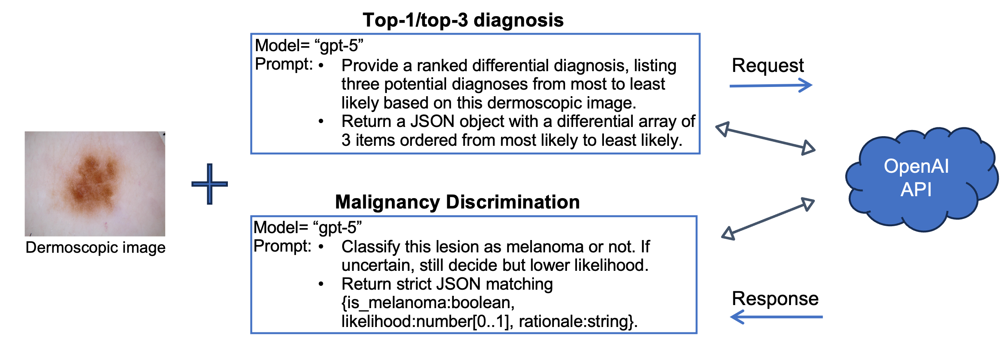
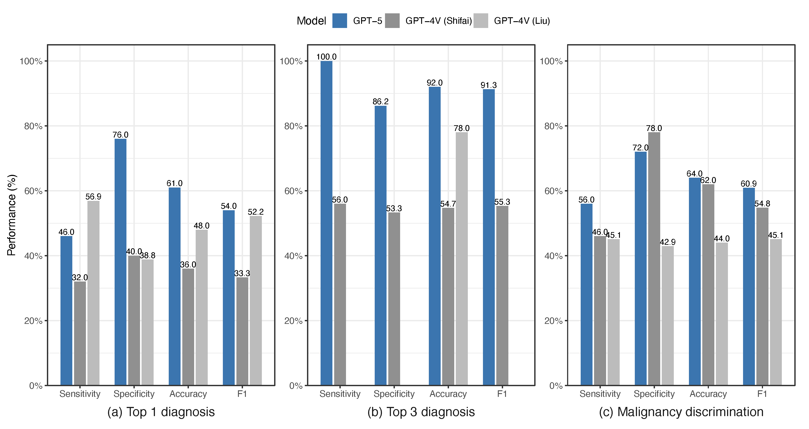
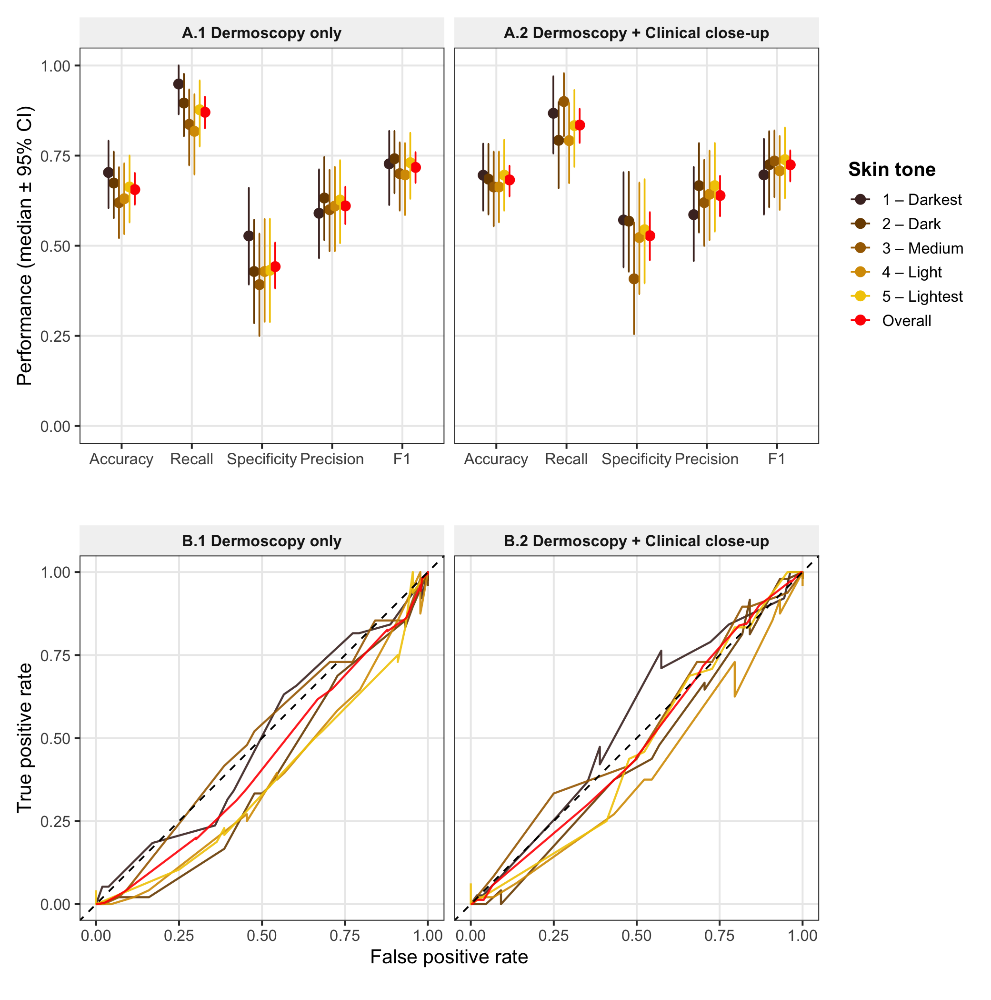

# LLMs for Melanoma Detection Using Dermoscopic Images

<!--The objective of this project is to comprehensively evaluate the performance of the newly released GPT-5 (in Section 1) and GPT-5.2 (in Section 2) for melanoma detection.
-->
## System setup

To run the code on this Github site, a valid OpenAI API account and an API key are required. You can follow the following steps to set up your running environment:

1. Sign up at the OpenAI API platform.
2. Set up your payment method.
3. Generate an API key at https://platform.openai.com/api-keys, if you don't have it yet. 
4. Save your key as a global environment variable, OPENAI_API_KEY, so you can access across various applications and scripts on your system without hardcoding it.

## 1. GPT-5 diagnostic performance on two dermoscopy image datasets, ISIC Archive and HAM10K (data & code under folder [assessment-on-isic](./assessment-on-isic))

### Data sources
This project uses two popular datasets, the International Skin Imaging Collaboration (<strong>ISIC</strong>) Archive (https://api.isic-archive.com/images/) and the Human Against Machine with 10,000 training images (<strong>HAM10000</strong> or <strong>HAM10K</strong>) dataset (https://www.kaggle.com/datasets/kmader/skin-cancer-mnist-ham10000), to assess GPT-5's performance in melanoma detection. 

(1) A previous study by Shifai et al. randomly selected 50 melanomas and 50 benign nevi from <strong>ISIC</strong> to benchmark GPT-4V (PMID: 38244612, DOI: 10.1016/j.jaad.2023.12.062). To make our assessment comparable with theirs, we obtained the identifiers of these ISIC images from their publication and provided them in a file isic-100-image-ids.txt on this site. With these identifiers, we downloaded these 100 dermoscopic images from ISIC, along with the corresponding metadata, using our Python script download_images.py. 
       
(2) From the <strong>HAM10K</strong> dataset, a recent study randomly selected 500 dermoscopic images (PMID: 40117499, DOI: 10.2196/67551) to evaluate GPT-4T and GPT-4o. However, the study did not disclose the identifiers of the selected images. Following the description in that paper, we independently sampled 500 images from HAM10K to construct our test dataset. Given the independent sampling, however, the overlap between the two sets is expected to be small. To ensure reproducibility, we share the identifiers of our 500 images in a file ham10k-500-image-ids.txt.

The script download_images.py saves metadata into a file, isic_metadata.xlsx, to be used in downstream analysis.
        
### Prompting and assessment

(1) The melanoma detection is assessed using OpenAI API interface. The top-one or primary diagnosis and top-three differential diagnoses of GPT-5 were conducted using script isic_top3_eval.py. For each image, the script uses a zero-shot prompting approach to present the request to GPT-5 model. Below is the prompt we used:

        Provide a ranked differential diagnosis, listing three potential diagnoses 
        from most to least likely based on this dermoscopic image. Return a JSON
        object with key 'differential' array of exactly 3 items ordered from most 
        likely to least likely; each item must include: diagnosis (string), 
        confidence (0.0-1.0), and optionally a brief rationale.
The command to assess GPT-5 for top-3 differential diagnoses on ISIC: 

        python isic_top3_eval.py --images isic_images \ 
                --meta isic_images/isic_metadata.xlsx --sheet "Sheet1" \
                --out isic_out/preds-t3 --model gpt-5 \
                --truth-col "metadata.clinical.diagnosis_1"

The command to assess GPT-5 on HAM10K: 

        python isic_top3_eval.py --images ham10k_images \ 
                --meta ham10k_images/isic_metadata.xlsx --sheet "Sheet1" \
                --out ham10k_out/preds-t3 --model gpt-5 \
                --truth-col "metadata.clinical.diagnosis_1"

where isic_metadata.xlsx is the image metadata file created using script download_images.py.

(2) The malignancy discrimination were assessed using script isic_malignancy_eval.py, which uses the following prompt to ask GPT-5 to process each dermoscopic image:

        Classify this lesion as melanoma or not. If uncertain, still decide 
        but lower likelihood. Return strict JSON matching {is_melanoma:boolean, 
        likelihood:number[0..1], rationale:string}. 

The command to assess GPT-5 for malignancy discrimination on ISIC: 

        python isic_malignancy_eval.py --images isic_images \
                --meta isic_images/isic_metadata.xlsx  \
                --sheet "Sheet1" --out isic_out/preds 
                --model gpt-5 --truth-col "metadata.clinical.diagnosis_1"

### A snapshot of GPT-5's performance on ISIC
<!--A summary of GPT-5 performance in melanoma detection on ISIC:  -->

<!--GPT-5 performance on HAM10K:-->

<!--img src="images/Figure_4.png" width="380"-->

### Publication

For comprehensive analysis and results of GPT-5, please see our recent publication below.

    Wang, Q; Amugo, I; Rajakaruna, H; Irudayam, MJ; Xie, H; Shanker, A; Adunyah, SE 
    Evaluating GPT-5 for Melanoma Detection Using Dermoscopic Images. Diagnostics 
    2025, 15, 3052. https://doi.org/10.3390/diagnostics15233052

## 2. GPT-5.2 performance across skin tones on skin image dataset Milk10K (data & code under [assessment-on-milk10k](./assessment-on-milk10k))

The most recent GPT-5.2 model released in December 2025 was used in this assessment.

### Data sources
The ISIC Archive and HAM10K dataset, although widely used, predominantly contain images from light-skinned individuals and lacks standardized skin tone annotations, limiting its suitability for assessing ChatGPT's robustness across diverse populations. 

After surveying dermatology image datasets, we identified <strong>Milk10K</strong> as a suitable resource for evaluating GPT diagnostic performance across skin tones. We were unable to obtain access to the Diverse Dermatology Images (DDI) dataset during the project period. All dermoscopic images, clinical close-up, and metadata of Milk10K are publically available through the ISIC Archive, Kaggle, and can be obtained directly from https://api.isic-archive.com/doi/milk10k/. 

From the Milk10K dataset, we randomly selected 92 lesions per skin tone class to construct a balanced subset for evaluating GPT-5.2. This subset comprises 460 unique lesions (92 per skin tone group) and 920 total images. To ensure reproducibility, we provided the identifiers of the selected images in file, milk10k-460-image-ids.csv, which were used consistently across all experiments.

### Prompting

Because our earlier results on the ISIC and HAM100K datasets indicated that GPT-5 was not well suited for top-1 diagnosis (see Results in Section 1 above), the present evaluation focused on two clinically relevant diagnostic tasks: (1) malignancy discrimination, and (2) top-three differential diagnoses. 

(1) For each skin lesion, we used the zero-shot prompting approach to submit requests to the GPT-5.2 model via the OpenAI API interface. A standardized and formal prompt format was applied to ensure consistency across evaluations. The prompt used for malignancy discrimination in the dermoscopy-only scenarios is provided below:

<!--* Dermoscopy only-->

       Task: classify the lesion as Malignant or Benign based on this dermoscopic image.
       Return ONLY valid JSON with keys:
         pred: 'Malignant' or 'Benign'
         confidence: number from 0 to 1
       No extra keys. No prose.
<!--* Dermoscopy plus clinical close-up

       Task: classify the lesion as Malignant or Benign based on this dermoscopic image
             and the clinical close-up.
       Return ONLY valid JSON with keys:
         pred: 'Malignant' or 'Benign'
         confidence: number from 0 to 1
       No extra keys. No prose.-->

(2) We tested different prompts and found minor variations in prompt wording did not materially affect the outcomes. So we used a single standardized prompt to generate the top-3 differential diagnoses for both scenarios to maintain simplicity and consistency, as follows:

       You are evaluating a skin lesion based on a dermoscopic image 
             (along with clinical close-up if provided).
       Task: Provide an ordered Top-3 differential diagnosis list 
           (most to least likely) for the lesion shown.

       Return ONLY valid JSON with exactly this key:
         differential: [
           {"diagnosis": "...", "confidence": 0.0},
           {"diagnosis": "...", "confidence": 0.0},
           {"diagnosis": "...", "confidence": 0.0}
         ]
       Rules:
       - Provide exactly 3 items.
       - 'confidence' must be a number in [0,1] and non-increasing.
       - Strict JSON only (double quotes). No extra keys. No prose. No code fences.

### Assessment

The malignancy discrimination were assessed using script milk10k_malignancy_eval.py. In current version, the image folder and metadata file are hardcoded. After setting correct file paths, run the following command and GPT diagnosis results will be automatically collected, processed, and stored in two seperate files, gpt52_milk10k_derm_only_predictions.csv and gpt52_milk10k_derm_plus_clin_predictions.csv.

        python milk10k_malignancy_eval.py

The top-three differential diagnoses of GPT-5.2 were conducted using script milk10k_top3_eval.py. Below is the command used:

        python milk10k_top3_eval.py

<!--### Top-3 differential diagnostic performance 
A summary of GPT-5.2 performance in top-3 differential diagnosis accross skin tones:   

-->

### Publication

Our results suggest that GPT-5.2 exhibits stable melanoma-related diagnostic performance across diverse skin tones
on Milk10K.For comprehensive analysis and results of GPT-5.2, please see our recent publication below.

    Frederickson, KL; Adunyah, SE; Wang, Q 
    Evaluation of GPT-5.2 for Melanoma Detection Across Skin Tones. 
    Frontiers in Medicine - Dermatology, 2026. 13:1816102.  
    https://doi.org/10.3389/fmed.2026.1816102

## 3. Integrating Convolutional Neural Networks (CNNs) with GPT-5.5 for melanoma diagnosis

### CNN models 
Our framework integrates GPT-5.5 with two independently developed CNN models, a multimodal ResNet-50 model trained on the MILK10K dataset for multiclass skin lesion classification and the first-place 90-model SIIM-ISIC ensemble optimized for melanoma detection. 

1. <strong>CNN ensemble</strong> ranked first place in the SIIM-ISIC Melanoma Classification Challenge: https://www.kaggle.com/datasets/boliu0/melanoma-winning-models/. Command to download all models: 

   kaggle datasets download -d boliu0/melanoma-winning-models
   
3. <strong>ResNet-50</strong> model trained on MILK10K: https://codeberg.org/ptschandl/MILK10k_train_base. After downloading the code, MILK10K dataset, and preparing a python environment, you can then create the ResNet-50 model by running start.sh as follows (start.sh is a downloaded file):

   ./start.sh

 ### Data source
All evaluations were performed on the <strong>Derm7pt</strong> dataset (https://github.com/jeremykawahara/derm7pt), which contains 1011 pairs of clinical close-up and dermoscopic images with expert-confirmed histopathological or clinical reference diagnoses and comprehensive clinical metadata. The dataset also includes annotations based on the seven-point checklist. Derm7pt was selected as an independent external benchmark because neither the widely used ISIC Archive nor the MILK10K datasets were suitable for evaluation, as both had been used to train the CNN models assessed in this study.

 ### Commands for generating assessment results

Below are the commands we used to assess and compare four AI approaches for melanoma diagnosis on Derm7pt:

       python siim90_assess_derm7pt.py \
             --csv ../derm7pt/release_v0/meta/meta.csv \
             --image_dir ../derm7pt/release_v0/images \
             --model_dir /Users/qwang/models/melanoma-winning-models \
             --image_col derm \
             --diagnosis_col diagnosis \
             --output_csv siim90_predict_on_derm7pt/siim90_derm7pt_predictions.csv \
             --output_metrics siim90_predict_on_derm7pt/siim90_derm7pt_metrics.json
       
       
       python resnet_assess_derm7pt.py \
             --csv ../derm7pt/release_v0/meta/meta.csv \
             --image_dir ../derm7pt/release_v0/images \
             --run_dir runs/20260605_083158 \
             --topk 5 \
             --output_csv resnet_predict_on_derm7pt/resnet_derm7pt_predictions.csv \
             --output_metrics resnet_predict_on_derm7pt/resnet_derm7pt_metrics.json \
             --topk 3
       
       
        python gpt_assess_derm7pt.py \
             --csv ../derm7pt/release_v0/meta/meta.csv \
             --image_dir ../derm7pt/release_v0/images \
             --model gpt-5.5 \
             --output_csv gpt_derm7pt_predictions.csv \
             --output_metrics gpt_derm7pt_metrics.json
       
       
        python gpt_fusion_assess_derm7pt.py \
             --resnet_csv ../milk10k_train_base/resnet_predict_on_derm7pt/resnet_derm7pt_predictions.csv \
             --siim_csv ../SIIM-ISIC-Melanoma-Classification-1st-Place-Solution-master/siim90_predict_on_derm7pt/siim90_derm7pt_predictions.csv \
             --model gpt-5.5 \
             --output_csv gpt_fusion_derm7pt_predictions.csv \
             --output_metrics gpt_fusion_derm7pt_metrics.json
