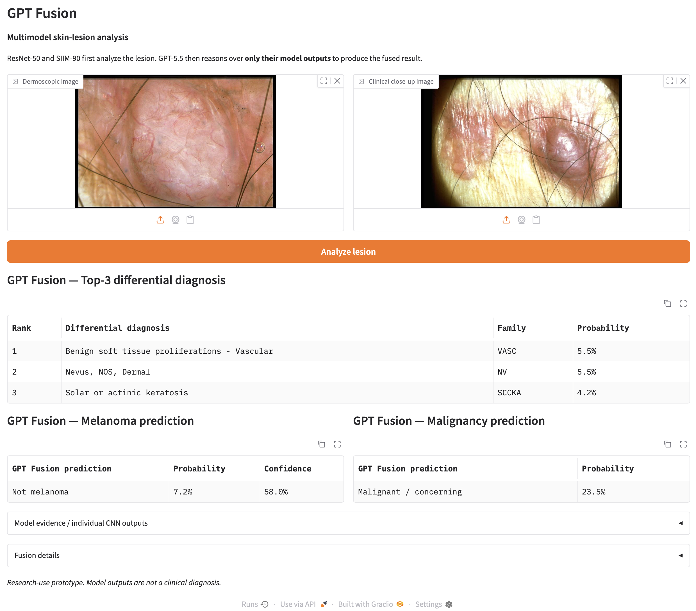

## 1. Assessments of LLMs for melanoma diagnosis

Before developing GPT Fusion, we systematically evaluated the diagnostic performance of LLMs on public dermoscopic image datasets.

### GPT-5 diagnostic performance on ISIC Archive and HAM10K

We evaluated GPT-5 for melanoma detection using dermoscopic images from the ISIC Archive and HAM10K, including primary diagnosis, top-three differential diagnosis, and melanoma discrimination. Data, source code, prompts, and detailed instructions for reproducing the assessment are available in [assessment-on-isic](./assessment-on-isic).

For comprehensive analysis and results, we refer readers to our recent publication:

    Wang Q, Amugo I, Rajakaruna H, et al. Evaluating GPT-5 for Melanoma Detection Using
    Dermoscopic Images. Diagnostics 2025. https://doi.org/10.3390/diagnostics15233052

### GPT-5.2 performance across skin tones

We also evaluated GPT-5.2 using a balanced subset of 460 lesions from <strong>Milk10K</strong> dataset (92 lesions from each of five skin-tone groups). The assessment focused on malignancy discrimination and top-three differential diagnosis using dermoscopic images alone or together with clinical close-up images. GPT-5.2 demonstrated generally stable melanoma-related diagnostic performance across the evaluated skin tones. Data, source code, and prompts are available in [assessment-on-milk10k](./assessment-on-milk10k).

For comprehensive analysis and results, see:

    Frederickson KL, Adunyah SE, Wang Q. Evaluation of GPT-5.2 for Melanoma Detection 
    Across Skin Tones. Front. Med. 2026, 13:1816102. doi: 10.3389/fmed.2026.1816102

These evaluations demonstrated the potential of general-purpose multimodal LLMs for melanoma-related image interpretation while also revealing limitations of relying on an LLM alone. These observations motivated our subsequent work integrating LLM reasoning with specialized vision models in the GPT Fusion framework, provided in section below.

## 2. GPT Fusion: reasoning-based integration of Convolutional Neural Networks (CNNs) for melanoma diagnosis
<strong>GPT Fusion</strong> is a novel diagnostic framework that uses GPT-based reasoning to integrate complementary evidence from specialized vision models for melanoma diagnosis. By combining the strengths of multiple models within a unified reasoning framework, GPT Fusion enhanced melanoma diagnoses.

GPT Fusion was implemented as a standalone, locally deployable software tool that provides an end-to-end workflow for multimodal skin lesion analysis. The complete application, including the web-based user interface implemented in [gpt-fusion-ui.py](./gpt-fusion-ui.py), supporting Python modules, and pretrained CNN models, can be installed and run locally as a self-contained diagnostic system. Through the web interface, users can upload a clinical close-up image together with the corresponding dermoscopic image of a skin lesion. The system then automatically executes the integrated models, synthesizes their complementary predictions through GPT-based reasoning, and presents the fused diagnostic results. The screenshot below shows the GPT Fusion output for an example skin lesion.

<table align="center">
  <tr>
    <td>
      
    </td>
  </tr>
</table>

### CNN models 
GPT Fusion uses GPT-5.5 reasoning to integrate the outputs of two independently developed CNN models, (i) a multimodal ResNet-50 model trained on the MILK10K dataset for multiclass skin lesion classification, and (ii) the first-place 90-model SIIM-ISIC ensemble optimized for melanoma detection. 

1. <strong>CNN ensemble</strong> ranked first place in the SIIM-ISIC Melanoma Classification Challenge: https://www.kaggle.com/datasets/boliu0/melanoma-winning-models/. Command to download all models: 

       kaggle datasets download -d boliu0/melanoma-winning-models
   
3. <strong>ResNet-50</strong> model trained on MILK10K: https://codeberg.org/ptschandl/MILK10k_train_base. After downloading the code, MILK10K dataset, and preparing a python environment, you can then create the ResNet-50 model by running start.sh as follows (start.sh is among the downloaded files):

       ./start.sh

 ### Data source

Although GPT Fusion can accept any compatible skin lesion images as input, an independent, publicly available dataset, <strong>Derm7pt</strong> (https://github.com/jeremykawahara/derm7pt), was selected as the primary external benchmark. Derm7pt contains 1,011 paired clinical close-up and dermoscopic images with expert-confirmed histopathological or clinical reference diagnoses and comprehensive clinical metadata. The dataset also provides annotations based on the seven-point checklist. The widely used ISIC Archive and MILK10K datasets were not used to assess GPT Fusion because they had been used to train the CNN models incorporated into the framework.

 ### Commands for generating the assessment results in the manuscript

Below are the commands and Python scripts we used to assess and compare four AI approaches for melanoma diagnosis on Derm7pt:

       python siim90_assess_derm7pt.py \
             --csv ../derm7pt/release_v0/meta/meta.csv \
             --image_dir ../derm7pt/release_v0/images \
             --model_dir /Users/qwang/models/melanoma-winning-models \
             --image_col derm \
             --diagnosis_col diagnosis \
             --output_csv siim90_predict_on_derm7pt/siim90_derm7pt_predictions.csv \
             --output_metrics siim90_predict_on_derm7pt/siim90_derm7pt_metrics.json
       
       
       python resnet_assess_derm7pt.py \
             --csv ../derm7pt/release_v0/meta/meta.csv \
             --image_dir ../derm7pt/release_v0/images \
             --run_dir runs/20260605_083158 \
             --topk 5 \
             --output_csv resnet_predict_on_derm7pt/resnet_derm7pt_predictions.csv \
             --output_metrics resnet_predict_on_derm7pt/resnet_derm7pt_metrics.json \
             --topk 3
       
       
        python gpt_assess_derm7pt.py \
             --csv ../derm7pt/release_v0/meta/meta.csv \
             --image_dir ../derm7pt/release_v0/images \
             --model gpt-5.5 \
             --output_csv gpt_derm7pt_predictions.csv \
             --output_metrics gpt_derm7pt_metrics.json
       
       
        python gpt_fusion_assess_derm7pt.py \
             --resnet_csv ../milk10k_train_base/resnet_predict_on_derm7pt/resnet_derm7pt_predictions.csv \
             --siim_csv ../SIIM-ISIC-Melanoma-Classification-1st-Place-Solution-master/siim90_predict_on_derm7pt/siim90_derm7pt_predictions.csv \
             --model gpt-5.5 \
             --output_csv gpt_fusion_derm7pt_predictions.csv \
             --output_metrics gpt_fusion_derm7pt_metrics.json

### Preprint

    Frederickson, KL, Li, D, Edrich, OD, et al. GPT Fusion: Reasoning-Based Integration 
    of Specialized Convolutional Neural Networks for Melanoma Diagnosis. Research Square, 
    rs.3.rs-10500601. August 2026. https://doi.org/10.21203/rs.3.rs-10500601/v2
    
